## Your Main Tasks:

### Time Measurement:

>>**Measure the execution time for each command to assess their performance.

``` bash
   I will use $time {command}
```
### System Interaction Identification:

>>**Identify which system stack (e.g., file system, network) each command
	  interacts with during execution.
``` bash
  I will use $ strace -c -e trace={stack} {command}
```
### Syscall Time Breakdown:

>>**Break down the total execution time of each command into time per
	  system call to understand their resource consumption.

``` bash
  I will use $ strace -c {command}
```
### Performance Evaluation:

>>**Analyze the results to determine which command performs better than the
    other based on execution time, system interaction, and syscall breakdown.

# ls vs. find
 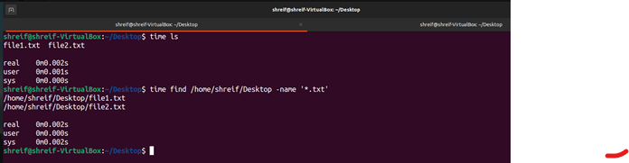
 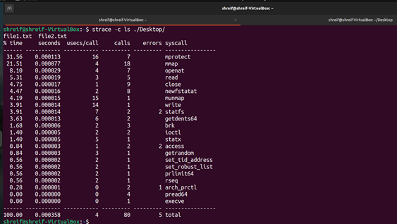
 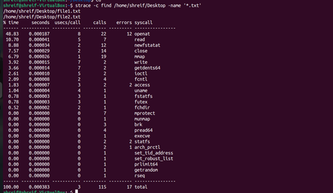
 
# cp vs. rsync
 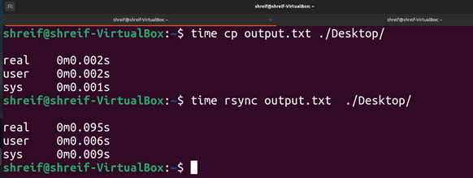
 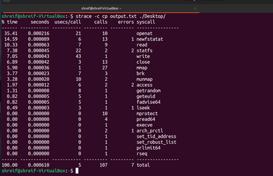
 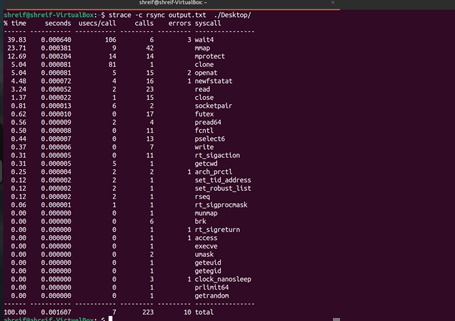
 
# diff vs. cmp
 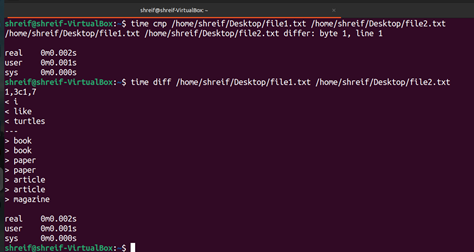
 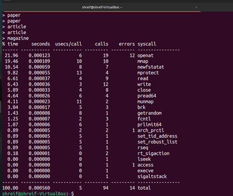
 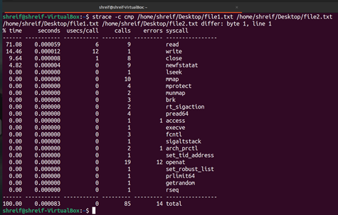
 
# sort vs. uniq
 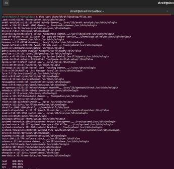
 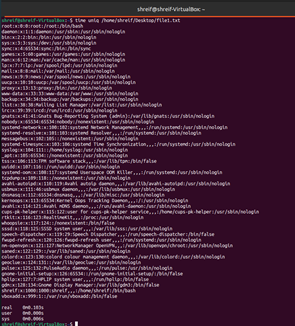
 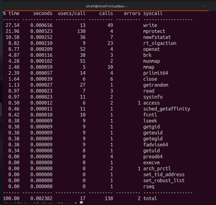
 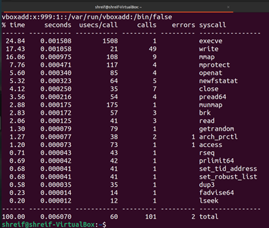
 
# grep vs. sed

 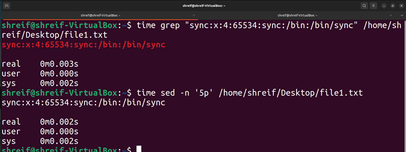
 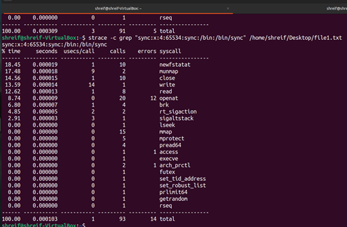
 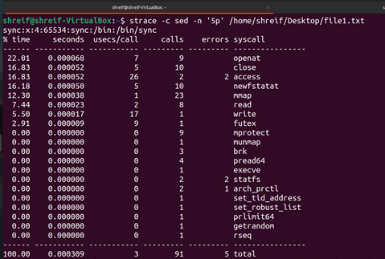


| Command       | Time       | No.of Stacks | Time break down | Performance |
| ------------- | ---------- | ------------ | --------------- | ----------- |
| ls vs. find   | ls         | same number  | ls              | ls          |
| cp vs. rsync  | cp         | rsync        | cp              | cp          |
| diff vs. cmp  | same time  | same number  | cmp             | cmp         |
| sort vs. uniq | sort       | same number  | sort            | sort        |
| grep vs. sed  | sed        | same number  | grep            | grep        |

| Filesystem Stack | Network Stack | Memory management Stack | Process Stack |
| ---------------- | ------------- | ----------------------- | ------------- |
| ls, find         | rsync         | ls, find                | ls, find      |
| cp, rsync        | ------        | cp, rsync               | cp, rsync     |
| diff, cmp        | ------        | diff, cmp               | diff, cmp     |
| sort, uniq       | ------        | sort, uniq              | sort, uniq    |
| grep, sed        | ------        | grep, sed               | grep, sed     |
