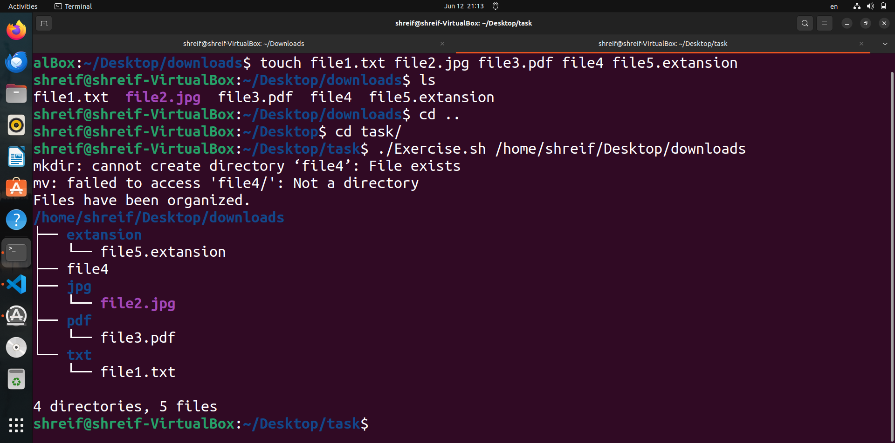
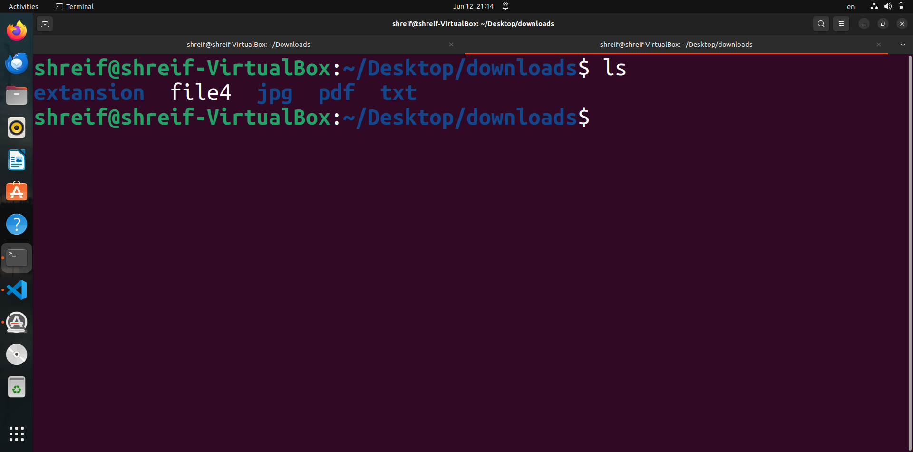

Project Idea: File Organizer
----
**The goal of this project is to create a Bash script that organizes files in a specified directory based on their file types into separate subdirectories. This can be useful to keep your directories clean and tidy by automatically sorting files into appropriate categories.**
## Features:
- The script should take a directory path as an argument and organize the files within that directory.
- It should create subdirectories based on the file extensions (e.g., "txt" for text files, "jpg" for image files).
- Files with unknown or no file extensions should be placed in a "misc" subdirectory.
- If a subdirectory for a particular file type already exists, the script should move the files into that existing directory.
- The script should handle edge cases, such as files with no extensions or hidden files (those starting with a dot).
## Script:
```bash
#!/bin/bash
 
declare DIRPATH=$1  # Global variable that carry the directory path taken from the user

# Function to get the extention of the file to know its type
function GetExtention () {
    
    declare  FILEPATH=$1
    declare  EXTENTION
    
    EXTENTION="${FILEPATH#*.}"
    echo "$EXTENTION"   # Return the extention value

}
#---------------------------------------------------------------------------------------------------------------------------------#
# Function that take the text file and move it to the txt subdirectory
function Move2txt () {
   
    declare  FILE=$1
    declare  SUBDIR="$DIRPATH/txt"

# Create the directory if it is not exist only
if ! [ -d "${SUBDIR}" ]; then   

    mkdir  "${SUBDIR}"
fi

mv "${FILE}" "${SUBDIR}"   # Move the file.txt to the txt subdirecyory

}
#---------------------------------------------------------------------------------------------------------------------------------#
# Function that take the images and move it to the jpg subdirectory
function Move2jpg () {
   
    declare  FILE=$1
    declare  SUBDIR="$DIRPATH/jpg"

# Create the directory if it is not exist only
if ! [ -d "${SUBDIR}" ]; then   
    mkdir "${SUBDIR}"
fi

mv "${FILE}" "${SUBDIR}"   # Move the file.txt to the txt subdirecyory
}
#---------------------------------------------------------------------------------------------------------------------------------#
# Function that take the PDF files and move it to the pdf subdirectory
function Move2pdf () {
   
    declare  FILE=$1
    declare  SUBDIR="$DIRPATH/pdf"

# Create the directory if it is not exist only
if ! [ -d "${SUBDIR}" ]; then   
    mkdir "${SUBDIR}"
fi

mv "${FILE}" "${SUBDIR}"   # Move the file.txt to the txt subdirecyory
}
#---------------------------------------------------------------------------------------------------------------------------------#
# Function that take the any other files like (hidden files, no extention and unknown extention) and move it to the misc subdirectory
function Move2misc () {
   
    declare  FILE=$1
    declare  SUBDIR="$DIRPATH/misc"

# Create the directory if it is not exist only
if ! [ -d "${SUBDIR}" ]; then   
    mkdir "${SUBDIR}"
fi

mv "${FILE}" "${SUBDIR}"   # Move the file.txt to the txt subdirecyory
}
##################################################################################################################################


############################################## 3. Main function (Script logic) ###################################################
function main () {
    
    DIRPATH=$1
    declare  EXTENTION
   
    # Check if the user write a correct directory path or not
    if  ! [ -d "${DIRPATH}" ]; then   
        echo "Error: This directory not exist"
        exit 1  # Terminate a programe with falier status 
    fi

    
    # Iterrate over the required directory 
    for file in "${DIRPATH}"/*; do
        
        # Check the extention of each file inside this directory and organize it
        if [[ -f "${file}" ]]; then 


            EXTENTION=$(GetExtention "${file}") 

            case "${EXTENTION}" in
                txt)
                    
                    echo "${file} is moved to txt subdirectory"
                    Move2txt "${file}"
                ;;
                jpg)
                    echo "${file} is moved to jpg subdirectory"
                    Move2jpg "${file}"
                ;;
                pdf)
                    echo "${file} is moved to pdf subdirectory"
                    Move2pdf "${file}"
                ;;
                *)
                    echo "${file} is moved to misc subdirectory"
                    Move2misc "${file}"
                ;;
            esac   
        fi
    done

    # Itterate over the hidden files found in the required directory 
    for file in "${DIRPATH}"/.*; do
        if [ -f "${file}" ]; then
            echo "Hidden file ${file} is moved to misc subdirectory"
            Move2misc "${file}"
        fi
    done
}

####################################### 4. Calling main function with its arguments ######################################## 

main "${DIRPATH}"

echo "Files have been organized."

# print files in the directory

tree "$DIR_PATH"
```
## Before run script:

## After run script:

