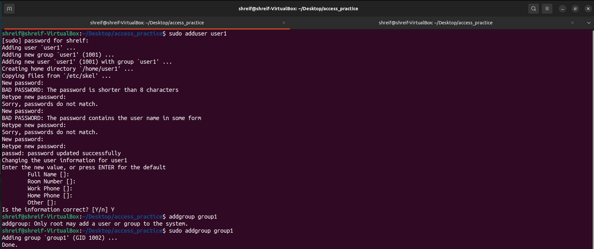

## Task
**Ownership and resources Managements.**
### Exercise 1: File Permissions and Ownership
* Create a directory called access_practice.
* Inside the directory, create a file named secret.txt.
* Set the file permissions to allow read and write access for the owner, and no access for group and others.
* Change the ownership of the file to a different user.
* Try accessing the file from the original and the different user accounts to observe the access permissions in action.

### Exercise 2: User and Group Management
* Create a new user named user1.
* Create a new group named group1.
* Add user1 to group1.
* Change the ownership of secret.txt to user1 and group1.
* Set the file permissions to allow read and write access for the owner and the group.
* Test accessing the file both as user1 and a different user to understand group-based access control.

