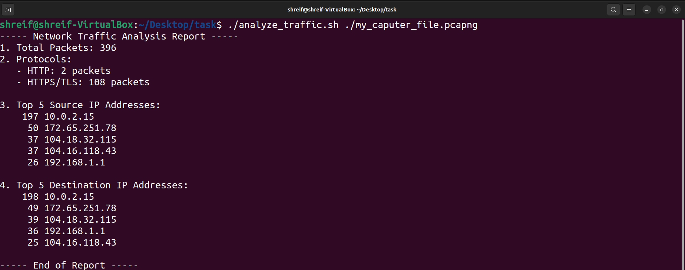

# kernel-graduation-project

## Network Task Requirements Document


### 1. Objective
The primary objective of this network task is to analyze network traffic using Wireshark and automate specific tasks with a Bash script, generating a summary report.


### 2. Scope
1. Capture network traffic using Wireshark.
2. Develop a Bash script to analyze the captured data.
3. Extract relevant information like total packets, protocols, and top source/destination IP addresses.
4. Generate a summary report based on the analysis.


### 3. Prerequisites
1. Wireshark installed.
2. Permission to capture network traffic.
3. Basic Bash scripting knowledge.


### 4. Wireshark Capture
1. Start Wireshark and capture network traffic.
2. Save the captured data in a pcap file (e.g., your_capture_file.pcap).


## 5. Bash Script
1. Create a Bash script named analyze_traffic.sh.
* Use the script to:
a. Specify the path to the Wireshark pcap file.
b. Analyze the data to identify patterns.
c. Extract information like total packets, protocols, etc.
d. Generate a summary report.


### Hints:

1. Research Wireshark command-line tools like tshark for packet analysis.
2. Use filters to focus on HTTP (http) and HTTPS/TLS (tls) protocols.
3. Explore options for counting packets, extracting IP addresses, and generating summary statistics.

### 6. Output
The Bash script should output a summary report containing identified patterns and key statistics.

----------------------------------

#### 🗒️ 🗒️ 🗒️ 🗒️ Expected Input:

Suppose you have a Wireshark pcap file named network_traffic.pcap containing a mix of HTTP and HTTPS traffic.

#### 🗒️ 🗒️ 🗒️ 🗒️ Expected Output:

```txt
----- Network Traffic Analysis Report -----
1. Total Packets: 1000
2. Protocols:
   - HTTP: 600 packets
   - HTTPS/TLS: 400 packets

3. Top 5 Source IP Addresses:
   - 192.168.1.1: 300 packets
   - 192.168.1.2: 200 packets
   - ...

4. Top 5 Destination IP Addresses:
   - 10.0.0.1: 400 packets
   - 10.0.0.2: 300 packets
   - ...

----- End of Report -----

```
#### 🗒️ 🗒️ 🗒️ 🗒️ My Input:

```shell
$ ./analyze_traffic.sh ./my_caputer_file.pcapng
```
#### 🗒️ 🗒️ 🗒️ 🗒️ My Output:


